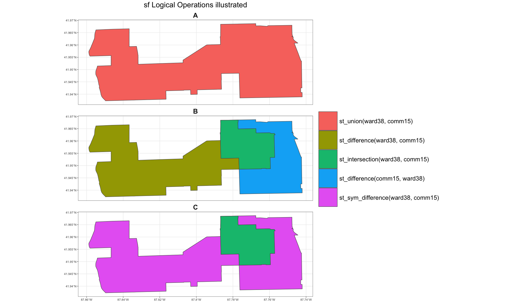

```{r setup, include=FALSE}
library(learnr)
knitr::opts_chunk$set(echo = TRUE,
                      comment = "",
                      warning = FALSE)
```


## Introduction

This is a work-in-progress tutorial covering the `sf` R package. `sf` provides a powerful interface for R users to work with geospatial data stored in vector formats. 

The name comes from *simple features* or *simple feature access* which refers to a formal standard (ISO 19125-1:2004) that describes how objects in the real world can be represented in computers, with emphasis on the spatial geometry of these objects. (This description taken verbatim from the first package vignette.)

**Note: on the use of `ggplot2`/`tmap`** 

This tutorial makes ample use of the `ggplot2` package. It is the data visualization solution that I am most familiar and comfortable with. There are other visualization packages that can be used along with `sf`: notably `tmap`. I aim to learn `tmap` and incorporate relevant examples in future versions.  


#### Data 

This tutorial uses several data files which are saved to a [github repository](https://github.com/thisisdaryn/R_tutorials/tree/master/data). In some instances, small changes have been made e.g. a change of file format, removing attributes from a data set. Each of these files was originally acquired from the [Chicago Data Portal](https://data.cityofchicago.org/) 

| File Name      | Description           | Original Data Source  |
|:---------------|:-------------|:------|
|Chi_Community_Areas.geojson | Community area boundaries | https://data.cityofchicago.org/Facilities-Geographic-Boundaries/Boundaries-Community-Areas-current-/cauq-8yn6  |
|CTA_Bus_Routes.geojson |CTA Bus Routes| https://data.cityofchicago.org/Transportation/CTA-Bus-Routes-Shapefile/d5bx-dr8z|
| Chicago_Libraries.geojson |Library locations in the city of Chicago| https://data.cityofchicago.org/Education/Libraries-Locations-Hours-and-Contact-Information/x8fc-8rcq/data |
| Chicago_Wards.geojson | Boundaries of Chicago City Council wards | https://data.cityofchicago.org/Facilities-Geographic-Boundaries/Boundaries-Wards-2015-/sp34-6z76 |


#### Resources

This tutorial aims to be an easy-to-follow introduction to `sf`. Many other resources are available for learning about the sf package, geocomputation using R, and geocomputation generally. 

These resources were very helpful to me in the learning about all of these as well as in the creation of this tutorial. 

  - [Geocomputation with R](https://geocompr.robinlovelace.net/) - Robin Lovelace, Jakub Nowosad, Jannes Muenchow 
  
  - sf: package vignettes 
    1. [Simple Features for R](https://r-spatial.github.io/sf/articles/sf1.html)
    2. [Reading, Writing and Converting Simple Features](https://r-spatial.github.io/sf/articles/sf2.html)
    3. [Manipulating Simple Feature Geometries](https://r-spatial.github.io/sf/articles/sf3.html)
    4. [Manipulating Simple Features](https://r-spatial.github.io/sf/articles/sf4.html)
    5. [Plotting Simple Features](https://r-spatial.github.io/sf/articles/sf5.html)
    6. [Miscellaneous](https://r-spatial.github.io/sf/articles/sf6.html)
    
    
  - [R Spatial Workshop Notes](https://spatialanalysis.github.io/workshop-notes/) - Angela Li
  
  - [Simple Feature Objects](https://www.jessesadler.com/post/simple-feature-objects/) - Jesse Sadler 


## Reading in data 


First we read in each of the data sets we will be using the `sf::st_read`. 

### Chicago Community Areas

```{r input1, message = FALSE}
library(sf)
comms <- st_read("https://raw.githubusercontent.com/thisisdaryn/R_tutorials/master/data/Chicago_Community_Areas.geojson") 
```

**Interpreting the information shown on screen**

Several pieces of information are output and are worth considering/understanding. In particular:

  * <i>geometry type</i>, what type of geometric entities are represented in this data. In this case, the value <i>MULTIPOLYGON</i> tells us what types of geographic entities are represented in the data.
  
  * <i>bbox</i>, a bounding box that contains the geographic elements described in the data 

  * <i>CRS</i>, [Coordinate Reference System (CRS)](. The value, <i>4326</i> indicates that this data uses the [WGS84](http://epsg.io/4326) CRS. CRSs determine how assigned values map to locations on the earth.
  
  

  
  
### Chicago Transit Authority Bus Routes
  

Next, we read in data describing the different bus routes offered by the Chicago Transit Authority (CTA):

```{r routesinput}
bus_routes <- st_read("https://raw.githubusercontent.com/thisisdaryn/R_tutorials/master/data/CTA_Bus_Routes.geojson")
```

Take note of some key differences between this output and the previous including:

  1. *geometry type*: MULTILINESTRING (as opposed to MULTIPOLYGON in the case of the community boundaries)
  
  2. *bbox*: these values look much different from those of the previous data frame. In fact they do not look like conventional longitude and latitude values at all. 

  2. *CRS*: 3435. This indicates that this data uses the [NAD83/Illinois East](http://epsg.io/3435) reference system. 

This illustrates that geospatial data can be encoded using multiple reference systems. 

**In order to work with data sets using different CRSs you should take care to convert all your data to a shared CRS.** 

One should not assume that coordinate values will represent longitude and latitude. (Also, even if coordinates are encoded in longitude and latitude values one should pay attention to the CRS. If you are working with multiple data sets it is important to be aware of which reference systems they are each coming from. Overlooking this may lead to incorrect computations.)


```{r routesshow}
bus_routes
```


We can see that there are several columns:

  * *ROUTE*: the route number
  
  * *NAME* the route name
  
  * *WKDAY*, whether or not (1/0) the bus runs on weekdays
  
  * *SAT*, whether or not the bus runs on Saturdays
  
  * *SUN*, whether or not the bus runs on Sundays
  
  * *SHAPE_LEN*, the length of the route 
  
  * *geometry* column holding the spatial descriptions of the bus routes


Similar to before, we can access the coordinates of a single geometry entry using `[[`. 

```{r showgeomroute, exercise = TRUE}
bus_routes$geometry[[1]]
```


### Chicago Libraries


Next, read in a data file with the locations of libraries within the city of Chicago:

```{r libsread}
libraries <- st_read("https://raw.githubusercontent.com/thisisdaryn/R_tutorials/master/data/Chicago_Libraries.geojson")
```
Here: 
  
  * the geometry type is POINT, indicating that each each location is a single point
  
  * the CRS is 4326, indicating that this data set uses the [WGS84](http://epsg.io/4326) CRS (just as *comms*)
  
```{r printlibs}
print(libraries)
```


### Chicago City Council Wards

Lastly, we will read in data specifying the wards within Chicago.

These wards are 50 political jurisdictions that elect one member each to the Chicago City Council. Unlike the community areas, ward boundaries are revised after each US Census to ensure that geographic regions have political representation commensurate with their proportion of the city population.  

```{r readwards}
wards <-  st_read("https://raw.githubusercontent.com/thisisdaryn/R_tutorials/master/data/Chicago_Wards.geojson")
```


  
## A closer look at sf objects  


First, use `class` to find out what class of object, <i>comms</i> is. 

```{r classcomms}
class(comms)
```


We see that <i>comms</i> is of class `sf` but also `data.frame`. This means that it can be used as a data frame would in other computations.

An `sf` object is essentially a data frame with a special geometry column that contains geospatial data. Other columns contain values that are termed *attributes*. 


We can also look at the class of the *geometry* column itself:

```{r}
class(comms$geometry)
```

A class `sfc` indicates that this column is a collection of simple features. A class `sfc_MULTIPOLYGON` tells that the geometry elements are of a specific type, MULTIPOLYGON. The different geometry types and collection types are listed in reference sections at the end of the tutorial. 


OK, let's look at the data in *comms*

```{r showcomms}
comms
```

If you scroll all the way over to the end there is a column named *geometry* and each element in this column is of type `sfc_MULTIPOLYGON`. That means that each items is a set of polygons. 


**Inspecting a MULTIPOLYGON closely**

Depending on where you have run the command you may be able to get a glimpse of what the data in the *geometry* column looks like. If you want to get a closer look at what the data in the *geometry* column you can explicitly select it from by running the code below. The output may seem like a lot but you will probably be able to identify values that are longitude and latitude pairs in Chicago, Illinois.

```{r showgeomelement, exercise = TRUE}
comms$geometry[[1]]
```


#### Exercise: What is the class of the *geometry* column of *libraries*?

Write code to see the class(es) of the *geometry* column of *libraries*:


```{r libgeom, exercise = TRUE}

```


```{r libgeom-solution}
class(libraries$geometry)
```


#### Exercise: Extract the geometry of the 3rd bus route in *bus_routes*

```{r busroute3, exercise = TRUE}

```


```{r busroute3-solution}
bus_routes$geometry[[3]]

```


## Creating an sf object 


The data sets we have read in thus far have automatically been read in as `sf` objects by `st_read` due to their format. 

Sometimes it is necessary to create an `sf` object manually from data containing attribute and geometry information. 

An example of this is the *Food_Inspections.csv* file which contains attribute and geometry information for restaurant inspections conducted in Chicago over a 4-day period in March 2020. 

Read the data in using `readr::read_csv`. 

```{r readinspections}
library(readr)
inspections_data <- read_csv("https://raw.githubusercontent.com/thisisdaryn/R_tutorials/master/data/Food_Inspections.csv")

```


We can convert from a typical data frame (or tibble) using the `st_as_sf` function. We have to specify the geographical coordinates are stored in the *Longitude* and *Latitude* fields of the table. 

```{r stsfinspections}
inspections <- st_as_sf(inspections_data, coords = c("Longitude", "Latitude"), 
                 crs = 4326)

```

Notice that the *Latitude* and *Longitude* columns are no longer included in the data frame. 
```{r}
inspections
```


**Note: using `read.csv` to read data **

We could have also used the `read.csv` function to read in the csv file above. 

If using a version of R prior to R 4.0, I recommend using this function with *stringsAsFactors* set to `FALSE` 

```{r readdot, eval = FALSE}
inspections <- read.csv("https://raw.githubusercontent.com/thisisdaryn/R_tutorials/master/data/Food_Inspections.csv", stringsAsFactors = FALSE)  
```

Using R 4.0 or above:

```{r readdot4, eval = FALSE}
inspections <- read.csv("https://raw.githubusercontent.com/thisisdaryn/R_tutorials/master/data/Food_Inspections.csv") 
```


## Getting the CRS and bounding box of an sf object

The `sf::st_crs` and `sf::st_bbox` functions return the CRS and bounding box of an sf object respectively.   

```{r commscrsbbox}
st_crs(comms)
st_bbox(comms)
```


## sf built-in plotting 


`sf` objects have a default plotting function that can be invoked by using the `plot` function with the object as input. For example, we can plot the data in *comms*:

```{r plotcomms}
plot(comms)
```


We can also select one (or more) attributes from the object before calling this built-in `plot` 

```{r plotattrs}
plot(comms[,"POP2010"])
```


`plot` creates a set of maps: one for each attribute in the data that is not the geometry. The interpretability or usefulness of these plots will vary with the nature of the attributes. 


#### Exercise: Use `plot` to generate plots of *bus_routes* and *libraries*. 

How should the resulting plots be interpreted? 

```{r sfplotex, exercise = TRUE}

```


## Transforming data from one CRS to another 

Before we move on, remember that we have data utilising different CRSs:

  * Data using WGS84 CRS
    * the map of community areas 
    * library locations
    * City Council wards
    
  * data using NAD83 CRS 
    * map of CTA bus routes

We will transform the data in the <i>bus_routes</i> data frame from NAD83 to WGS84 before moving forward.  

  * `sf::st_transform` will be used to transform the data in *bus_routes* to an equivalent representation in another CRS. `st_transform` requires two inputs: an sf object and a crs specification.

  * `sf::st_crs` will be used to get the CRS of *comms* to be used as the necessary 2nd input to `sf::st_transform`

```{r transformroutes}
routes_wgs <- st_transform(bus_routes, st_crs(comms))
print(routes_wgs)
```


#### Exercise: Extract the geometry of a specific bus route

Write code to see the geometry of the 3rd row of *routes_wgs*. Does this represent the same CTA route as we saw before?

```{r showgeomwgsroutes, exercise = TRUE}

```

```{r showgeomwgsroutes-solution}
routes_wgs$geometry[[1]]
```


##  Plotting using ggplot2 


Next, we create our first plot with the data, using the `ggplot2` package. 

If you are familiar with `ggplot2` the code below will look very similar to code for plots you have made before. e use the *comms* data frame as the data input and `ggplot2::geom_sf` as the geometry.  


```{r ggplotcomms}
library(ggplot2)

ggplot(data = comms) + 
  geom_sf()
```


#### Exercise: Plot CTA Bus Routes using ggplot2 

Using code similar to above, make a plot showing all of the CTA's bus routes 

```{r plotroutes, exercise = TRUE}
library(ggplot2)
```

```{r plotroutes-solution}
library(ggplot2)

ggplot(data = bus_routes) +
  geom_sf()

```


#### Exercise: Plot all Chicago library locations using ggplot2

Using code similar to above, make a plot showing all of the public libraries in the city of Chicago.

```{r plotlibraries, exercise = TRUE}

```

```{r plotlibraries-solution}
ggplot(data = libraries) +
  geom_sf()
```


## Subsetting data 

`sf` objects are data frames and can be subsetted like data frames. For instance if we wanted to restrict the data to the communities of Rogers Park, West Ridge, Uptown, Lincoln Square and Edgewater, we could do so using `dplyr::filter` (or with base R subsetting). 


```{r commsubset, message = FALSE}
library(dplyr)

community_group <- c("ROGERS PARK", "WEST RIDGE", "UPTOWN", "LINCOLN SQUARE", "EDGEWATER")
comm_group <- filter(comms, community %in% community_group)
print(comm_group)
```


Alternatively, the subsetting could have been done using base R syntax:

```{r subbase, eval = FALSE}
comm_group <- comms[comms$community %in% community_group, ]
```


#### Exercise: Plotting selected community areas 

Make a plot of only the community areas in the *comm_group* object.

```{r plotcommgroup, exercise = TRUE}

```

```{r plotcommgroup-solution}
#(The code below introduces a new additional geometry):
ggplot(data = comm_group) + 
  geom_sf() +
  geom_sf_text(aes(label = community))
```


#### Exercise: Plotting bus route 111A:

Subset *routes_wgs* to get a single bus route, 111A, and plot it.

```{r plot111A, exercise = TRUE}

```

```{r plot111A-solution}
route111A <- filter(routes_wgs, ROUTE == "111A")

ggplot() + 
  geom_sf(data = route111A) 
```


## Binary Predicates 


Next we will look at some of the binary predicate functions offered by the `sf` package. These functions allow us to compute if specified relationships exist between geospatial entities. These functions all start with the `st_` and have full names reflecting the relationship they are intended to identify. 

The list of binary predicate functions available in `sf` are: 


  * `st_intersects`

  * `st_disjoint`

  * `st_touches`

  * `st_crosses`

  * `st_within`

  * `st_contains`

  * `st_contains_properly`

  * `st_overlaps`

  * `st_equals`

  * `st_covers`

  * `st_covered_by`

  * `st_equals_exact`

  * `st_is_within_distance`


We will use some of these in examples in the upcoming sections.

### Example: st_intersects with x and y inputs

The most commonly-used of the binary predicate functions may be `st_intersects`. The function name implies that it can be used to determine if geospatial entities intersect.  

First, let's try `st_intersects` with two inputs. 

**Question: For each community area, can we identify the bus routes that intersect with it?**

Here we can provide *comms* and *routes_wgs* as arguments to `st_intersects`:

```{r intscommsroutes}
st_intersects(comms, routes_wgs)
```

**Understanding this output** 

The output above can be interpreted as:

  * The community in the first row of the *comms* object intersects with the routes in rows 5, 18, 29, 71, 78, 81, 87, 96, 108 and 113 of the *routes_wgs* object


  * The community in the second row of the *comms* object intersects with the routes in rows 3, 13, 53, 71, 81, 88, 96, and 101 of the *routes_wgs* object
  
  
  * etc etc etc 
  
  
**Note that the numbers in the output denote the row numbers in the input data object. Not the assigned number of the bus routes.** 


### Example: st_intersects with x input only


If the *y* argument is not specified, `st_intersects` - and all the other binary predicate functions -use *x* as the second argument as well. This has the effect of finding which features in *x* intersect with each other.

**Question: Which bus routes intersect with each other?**


```{r intsroutes}
route_intersections <- st_intersects(routes_wgs)
route_intersections
```

**Note that each bus route is listed as intersecting with itself.**


### Example: st_touches

You may also want to know which communities border a given community. Here we can use `st_touches`. 

**Question: which community areas border the Albany Park community?**

```{r albneighb}
albany_park <- filter(comms, community == "ALBANY PARK")
albany_neighbours <- st_touches(albany_park, comms)
albany_neighbours
```

We can get the names of these neighbouring areas:
```{r albneighbnames}
comms$community[albany_neighbours[[1]]]
```


All of this may raise a question: could `st_intersects` have been used in this situation as well? 

```{r intsalbcomms}
st_intersects(albany_park, comms)
```

Here the output is very similar but there is one more community in the list of neighbors. This is the Albany Park community itself.


**Question: Which libraries does each community area cover?**

Here we can use `st_covers`:

```{r coverscommslibs}
st_covers(comms, libraries)
```

Alternatively, we could have used `st_covered_by` with the order of the arguments reversed:

```{r coveredbylibscomms}
st_covered_by(libraries, comms)
```

This reflects the same information but presents the information


### A note on other binary predicate functions

The previous examples show only some of the binary predicate functions available in `sf`. Each of the binary predicate functions not discussed use similar syntax and are named in way that their use cases are self-hinting - if not self-evident. 


## Brief detour: A note about relational joins

Before we move on to spatial joins, we will review briefly the general concept of a relational join for those who are unfamiliar. 

Relational joins are perhaps best-known via their implementations in [SQL](https://en.wikipedia.org/wiki/Join_(SQL)). Relational joins combined data from two different data sets using some shared field 

Here we will take time to give a small example using a data set that is not geospatial (though it does contain geographic information).


For this example we will read in two data sets with the populations and areas of some countries respectively:

```{r readcountries, message = FALSE}
library(readr)
areas <- read_csv("https://raw.githubusercontent.com/thisisdaryn/data/master/Areas.csv")
populations <- read_csv("https://raw.githubusercontent.com/thisisdaryn/data/master/Populations.csv")
```

```{r showareas} 
areas
```

```{r showpops}
populations
```

We can see that both of these tables have a field named *Country*. Some countries are listed in both tables while others are only listed in one of the tables.

#### Full (outer) joins 
First, we will do a full/outer join using `dplyr::full_join`:

```{r fulljoin}
full_join(populations, areas)
```


#### Left joins

Next, we will do a left join: 

```{r leftjoin}
left_join(populations, areas)
```

We can see that the left join keeps all the countries in the *populations* table in the final output even if there's no available area information for those countries. Countries that are only in the *areas* table do not show up at all in the final table.

Now, let's try an inner join using `dplyr::inner_join`:


#### Inner joins

```{r innerjoin}
inner_join(populations, areas)
```

Here we see that only the countries that are in both tables show up in the final table. 

The spatial joins we do using `sf::st_join` will be analogous to either the left joins or the inner joins we have done here.

**Note**: When joining data, it is not always going to be the case that the joins will be as simple as the above example. For common : the keys may have different names in different data sets, the keys may be stored as different data types in different data sets, or muliple columns/variables may be required to be used as keys.

## Spatial Joins 

Often when working with geospatial data, we need to bring data from 2 (or more) data sets together based on a some articulation of shared geographic location. An instance of this process is known as a **spatial join**. 

Spatial joins are driven can be carried out by `sf::st_join` and are driven by the binary predicate functions we have just been introduced to. 

`sf::st_join` takes multiple arguments. We will use 4 key arguments:
  
  1. *x*: an sf object
  
  2. *y*: another sf object (defaults to *x* if this is not satisfied)
  
  3. *join*: a binary predicate function that indicates the spatial relationship to base the join on. (defaults to `st_intersects`)
  
  4. *LEFT*: indicates whether or not (TRUE/FALSE) a left join or an inner join is intended. (defaults to TRUE i.e. a left join is performed)
  


### Example: Adding community area information to the libraries

How can we determine the community area that each library is located in? Let's use `st_join` with the following inputs:

  - *x*: *libraries*
  
  - *y*: *comms*
  


```{r joinlibscomms}
libraries_comms <- st_join(libraries, comms)
```


We can look at the joined object:

```{r showlibscomms, echo = FALSE}
libraries_comms
```

  - The joined object has columns from both of the input objects

  - has a single geometry column, of type POINT, from the first input
  
  - there is one row for each row row in *libraries*
  
  - some communities show up multiple times 
  


```{r showcommslibs}
comms_libraries <- st_join(comms, libraries)
comms_libraries
```

  - this joined data frame has columns from both *libraries* and *comms*
  
  - the geometry column is taken from *comms*
  
  - some rows have `NA` values for all the fields that were originally in `comms`
  
  - some communities are in multiple rows of the joined data frame even though they were in only one row of `comms`
  
#### Key observation: `st_join` retains the geometry of the first input. 

If you want to keep rows in this table that do not have matching rows in the second input you must do a left join (the default, *left* = `TRUE`). If you wish to keep only the rows that are matched with rows in the second input you must do an inner join i.e. set *left* = `FALSE`. 


#### Exercise: Which communities have no libraries? 

Using a join, identify the community areas that have no libraries. Plot these communities on a map.

```{r nolibs, exercise = TRUE}

```


```{r nolibs-solution}
## Solution 1: using dplyr::filter
no_libraries <- st_join(comms, libraries) %>% 
  filter(is.na(name_))

# Solution 2: Using base R 
comms_libs <- st_join(comms, libraries)
no_libraries <- comms_libs[is.na(comms_libs$name_), ]

# Plotting the communities
ggplot(data = no_libraries) + 
  geom_sf()
```


#### Exercise:  Which communities does route 2 pass through?**
  
**Make a map of all the communities and route *2***
  
```{r show54b, exercise = TRUE}

```


```{r show54b-solution}
route2 <- filter(routes_wgs, ROUTE == "2")
comms2 <- st_join(comms, route2, st_intersects, left = FALSE)

ggplot() + 
  geom_sf(data = comms2) +
  geom_sf(data = route2, color = "blue") + 
  geom_sf_text(data = comms2, aes(label = community))
```

## Geometric unary operations

`sf` contains several geometric unary operations: operations that take a single input (`sfg`, `sfc` or `sf`) and return outputs of the same type as the input. The geometries of output objects reflect the nature of the operation.


Some of these geometric unary operators are: 

  - `st_centroid(x)`: centroids of geometries in x
  
  - `st_combine`: a single geometry combining multiple input geometries
  
  - `st_boundary`: boundaries of input geometries
  
  
### `st_centroid`

`st_centroid` takes a single collection of geometries and returns a collection of centroids, the geometric centers of the input geometries.

Here is an example of using `st_centroid` to find the geometric center of each community area.
  
```{r commscentroids}
comms_centroids <- st_centroid(comms)
comms_centroids
```

We see that there is an row of for each row in the input, *comms*. However the geometry is of type POINT (as opposed to MULTIPOLYGON in *comms*).


We can plot *comms* along with this new object *comms_centroids* to corroborate that the new object does contain the centroids of the original community areas.

```{r ggplotcentroids}
ggplot() + 
  geom_sf(data = comms) + 
  geom_sf(data = comms_centroids, color = "red")
```


### `st_combine`

`st_combine` takes an object containing a geometry collection and collapses the collection down to a single geometry. 

For example, here we combine all the geometries in *comms*

```{r combinecomms}
all_communities <- st_combine(comms)
all_communities
```

Note that the output consists of a single MULTIPOLYGON.

We can plot this MULTIPOLYGON.

```{r ggplotcombine}
ggplot(all_communities) + geom_sf()
```

All of the original community areas are retained in the graphical output. This shows that the collapsed geometry has all of the complexity of the original geometry collection embedded in it.

### `st_boundary`

`st_boundary` takes a collection of geometries as input and returns a geometry collection of equal dimension. 

```{r boundary}
comms_boundaries <- st_boundary(comms)
comms_boundaries
```
We see that there is a row for each community area. However the geometry type has been changed to MULTILINESTRING. This indicates that points on the interior of the boundary are not considered a part of the geometry. 

We can plot *comms_boundaries*. If you look closely, you can see that the map grid lines are no longer blocked by the community shapes. 

```{r ggplotboundary}
ggplot(comms_boundaries) + geom_sf()
```


## Binary Logical Operations


`sf` also has sevaral binary logical operators. These operators take a pair of geometries as input and return a single geometries for each pair.   
  
  - `st_union(x, y)`: all locations within x or y
  
  - `st_intersection(x, y)`: all locations within in x and y simultaneously
  
  - `st_difference(x, y)`: all locations in x but not in y
  
  - `st_sym_difference(x, y)`: locations within x or within y, but not both.


Let us consider Ward 38, a political district, and Community 15 (Portage Park), an identified community area. 


```{r w38c15}
ward38 <- filter(wards, ward == "38")
comm15 <- filter(comms, NID == "15")
```


Now, plot the two regions:

```{r plotw38c15}
ggplot() +
  geom_sf(data = ward38, fill = "red", alpha = 0.5) +
  geom_sf(data = comm15, fill = "blue", alpha = 0.5) + 
  theme_minimal()
```

We can see that they overlap. The maps below, illustrate the regions defined by the specified binary logical operators.


{width=100%}


#### Exercise: Using `st_union`

Reproduce the plot in A of the map above: showing the union of Ward 38 and Community 15

```{r unionplot, exercise = TRUE}

```

```{r unionplot-solution}
#your solution does not have to look exactly like this 
union_w38_c15 <- st_union(ward38, comm15)

ggplot(data = union_w38_c15) + 
  geom_sf()
```

#### Exercise: Using `st_difference` and `st_intersection`

Reproduce the plot in B of the map above:

```{r plotdiffint, exercise = TRUE}

```

```{r plotdiffint-solution}
#your solution does not have to be exactly the same as this
diff_w38_c15 <- st_difference(ward38, comm15)
diff_c15_w38 <- st_difference(comm15, ward38)
int_w38_c15 <- st_intersection(comm15, ward38)

ggplot()+ 
  geom_sf(data = diff_w38_c15, fill = "red") + 
  geom_sf(data = diff_c15_w38, fill = "blue") + 
  geom_sf(data = int_w38_c15, fill = "yellow")
```


#### Exercise: `Using st_sym_difference` and `st_intersection`

Reproduce the plot in C of the map above:

```{r plotsymdiffint, exercise = TRUE}

```


```{r plotsymdiffint-solution}
#your solution does not have to be exactly the same as this

symdiff_w38_c15 <- st_sym_difference(ward38, comm15)
int_w38_c15 <- st_intersection(comm15, ward38)

ggplot()+ 
  geom_sf(data = symdiff_w38_c15, fill = "purple") + 
  geom_sf(data = int_w38_c15, fill = "green") 
```

## Reference: Types of Geometries


Here is a list of common geometry types supported by `sf`. 

|Type | 	Description | 
|:---------------|:-------------|
|POINT	| zero-dimensional geometry containing a single point|
| LINESTRING |	sequence of points connected by straight, non-self intersecting line pieces; one-dimensional geometry | 
| POLYGON	| geometry with a positive area (two-dimensional); sequence of points form a closed, non-self intersecting ring; the first ring denotes the exterior ring, zero or more subsequent rings denote holes in this exterior ring | 
| MULTIPOINT | 	set of points; a MULTIPOINT is simple if no two Points in the MULTIPOINT are equal | 
| MULTILINESTRING	| set of linestrings | 
| MULTIPOLYGON |	set of polygons |
| GEOMETRYCOLLECTION | 	set of geometries of any type except GEOMETRYCOLLECTION | 


This table of descriptions was taken verbatim from the [`sf` package vignette #1](https://r-spatial.github.io/sf/articles/sf1.html). Descriptions of other - less common - geometries can also be found there. 


## Reference: sf object types

There are three main classes provided by `sf` for working with geospatial data:

  - `sfg`: geometry of a single feature. Has subclasses for each geometry type
  
  - `sfc`: a list of `sfg` objects. Has subclasses for each geometry type
  
  - `sf`: data frame with attribute columns along with a specified *geometry*  column (an `sfc`)
  
Emphasis has been placed on using objects of type `sf::sf` in this tutorial. However, `sf::sfg` and `sf::sfc` are important building blocks and in some circumstances you may find yourself having to work with these types more directly. 

Many of the functions illustrated in this tutorial with objects of class `sf::sf` are actually generics and have versions that will work with data stored as `sf::sfg` or `sf::sfc`. 

One particular source that I found useful in understanding the various objects is [Simple Feature Objects](https://www.jessesadler.com/post/simple-feature-objects/) by Jesse Sadler. 
  

    

